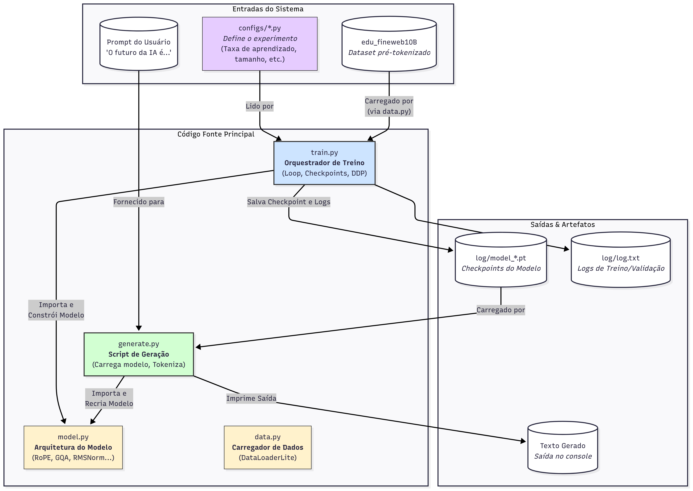
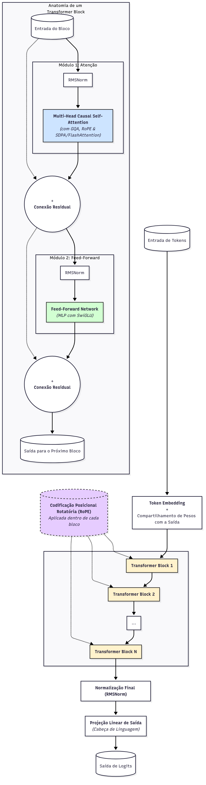

# nanoGPT-moderno: Uma Versão Avançada do nanoGPT

Este projeto é uma modernização extensiva do aclamado [nanoGPT](https://github.com/karpathy/nanoGPT) de Andrej Karpathy. O objetivo foi pegar a base de código simples e educacional do nanoGPT, que implementa a arquitetura original do GPT-2, e atualizá-la com as otimizações e melhorias arquitetônicas que definem os Modelos de Linguagem Grandes (LLMs) de última geração (padrão 2024), como Llama, Gemma e Mistral.

O resultado é uma base de código que permanece clara e legível, mas que agora é capaz de treinar modelos significativamente mais rápidos, eficientes e com maior capacidade de contexto.

## Principais Modernizações Implementadas

Esta versão incorpora 10 melhorias arquitetônicas e de engenharia cruciais:

1.  **Embeddings Posicionais Rotatórios (RoPE):** Substituímos os embeddings posicionais absolutos por RoPE, permitindo que o modelo generalize para janelas de contexto muito maiores do que as vistas durante o treinamento.
2.  **RMSNorm:** Trocamos o `LayerNorm` padrão pelo `RMSNorm`, que é computacionalmente mais leve e melhora a estabilidade do treinamento, sendo o padrão em LLMs modernos.
3.  **Ativação SwiGLU:** O MLP tradicional com GELU foi substituído por uma rede com a ativação `SwiGLU`, que demonstrou melhorar a eficiência e o desempenho dos parâmetros.
4.  **Grouped-Query Attention (GQA):** A arquitetura de atenção foi refatorada para suportar GQA (e MQA), reduzindo drasticamente o tamanho do KV-Cache, o que acelera a inferência e diminui o uso de memória.
5.  **SDPA (Flash Attention):** A implementação da atenção agora usa `torch.nn.functional.scaled_dot_product_attention`, que despacha automaticamente para kernels otimizados como FlashAttention-2 quando disponível, proporcionando um speedup massivo.
6.  **KV-Cache para Inferência Rápida:** O método de geração foi reescrito para usar um KV-Cache incremental, reduzindo a complexidade computacional da geração de O(T²) para O(T) por token.
7.  **Remoção de Bias:** Os termos de `bias` foram removidos das camadas lineares, uma prática comum que melhora a estabilidade em conjunto com o RMSNorm.
8.  **Logit Soft-Capping:** Uma técnica para limitar os valores dos logits na saída, melhorando a calibração do modelo e evitando saídas degeneradas em contextos longos.
9.  **Script de Treinamento Robusto:** O script `train.py` foi aprimorado com suporte a DDP estável, retomada de checkpoints (incluindo o estado do otimizador) e métricas de performance fiéis.
10. **Transferência de Pesos do GPT-2:** Implementamos um método para carregar e adaptar os pesos do GPT-2 pré-treinado da Hugging Face, permitindo um fine-tuning eficaz sem precisar treinar do zero.

---

## Diagramas da Arquitetura

Para visualizar as mudanças, aqui estão os diagramas do sistema geral e da arquitetura detalhada do modelo.

### Diagrama do Sistema Completo

Este diagrama mostra o fluxo de trabalho do projeto, desde a configuração até o treinamento e a geração de texto.


*(Substitua `path/to/your/system_diagram.png` pelo caminho da sua imagem do sistema)*

### Diagrama da Arquitetura do Modelo

Este diagrama oferece um "raio-x" da arquitetura interna do modelo, detalhando o fluxo de dados através dos blocos Transformer modernizados.


*(Substitua `path/to/your/model_diagram.png` pelo caminho da sua imagem do modelo)*

---

## Estrutura do Projeto

O projeto foi organizado de forma modular para clareza e manutenção:

```
nanoGPT-moderno/
├── model.py            # Definição da arquitetura do modelo GPT moderno.
├── train.py            # Script principal para orquestrar o treinamento.
├── generate.py         # Script para gerar texto usando um modelo treinado.
├── data.py             # Carregador de dados eficiente (DataLoaderLite).
├── configs/
│   ├── gpt2_from_scratch.py  # Config para treinar do zero.
│   └── gpt2_finetune.py      # Config para fine-tuning a partir do GPT-2.
└── README.md           # Este arquivo.
```

---

## Instalação e Preparação

**1. Clone o Repositório:**
```bash
git clone https://github.com/seu-usuario/nanoGPT-moderno.git
cd nanoGPT-moderno
```

**2. Crie um Ambiente Virtual e Instale as Dependências:**
```bash
python -m venv venv
source venv/bin/activate
pip install torch transformers tiktoken numpy
```
*(É recomendado usar PyTorch 2.0 ou superior para suporte ao `torch.compile` e SDPA).*

**3. Prepare os Dados:**
Este projeto espera dados pré-tokenizados no formato de arquivos `.npy`, organizados em um diretório. Por exemplo, para o dataset [FineWeb](https://huggingface.co/datasets/HuggingFaceFW/fineweb-edu), você precisará de um diretório como:
```
edu_fineweb10B/
├── fineweb_edu_train_000000.npy
├── fineweb_edu_train_000001.npy
└── fineweb_edu_val_000000.npy
```

---

## Como Usar

### 1. Treinar um Modelo do Zero
Este comando iniciará um treinamento usando a arquitetura moderna e os hiperparâmetros definidos em `gpt2_from_scratch.py`.
```bash
python train.py configs/gpt2_from_scratch.py
```
Para treinamento distribuído em múltiplas GPUs (ex: 4 GPUs):
```bash
torchrun --standalone --nproc_per_node=4 train.py configs/gpt2_from_scratch.py
```

### 2. Fine-tuning a partir do GPT-2
Este comando carregará os pesos compatíveis do GPT-2 pré-treinado e iniciará um fine-tuning com uma taxa de aprendizado menor.
```bash
python train.py configs/gpt2_finetune.py```

### 3. Retomar um Treinamento
Modifique o `init_from = 'resume'` no seu arquivo de configuração. O script procurará automaticamente pelo checkpoint `latest.pt` no diretório de log especificado.

### 4. Gerar Texto
Após o treinamento, use o script `generate.py` para ver seu modelo em ação.
```bash
# Exemplo usando o último checkpoint salvo de um treino
python generate.py log_scratch/latest.pt "The future of artificial intelligence is"
```

---

## Licença

Este projeto é licenciado sob a Licença MIT. Veja o arquivo `LICENSE` para mais detalhes.